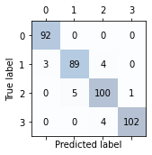
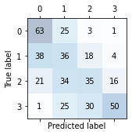
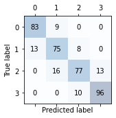
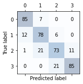

# 說明
本題使用SVM,KNN,DT,RF四種模型對mobile price資料集做分類
# 環境
google colaboratory
# 步驟
1. 下載[kaggle](https://www.kaggle.com/iabhishekofficial/mobile-price-classification)資料
2. 顯示與price_range關聯性高的特徵
3. 選擇特徵並把資料分為train及test，然後標準化
4. 訓練模型並顯示confusion matrix
5. 顯示模型的accuracy,precision,recall,F1-score,support個別的分數
# 分析
## SVM
### confusion matrix

### Performance metrics
    train Accuracy: 0.975
    test Accuracy: 0.958
    Precision: 0.958
    Recall: 0.958
    F1: 0.958
評語:使用SVM模型的各項分數為這四種模型最高的

## KNN
### confusion matrix

### Performance metrics
    train Accuracy: 0.719
    test Accuracy: 0.460
    Precision: 0.460
    Recall: 0.460
    F1: 0.460
評語:使用KNN模型的各項分數為這四種模型最低的

## Decision Tree
### confusion matrix

### Performance metrics
    train Accuracy: 1.000
    test Accuracy: 0.860
    Precision: 0.828
    Recall: 0.828
    F1: 0.828
評語:此模型在train data的評分是完美的，但是在test data的表現卻比較差一些，可能有overfitting

## Random Forest
### confusion matrix

### Performance metrics
    train Accuracy: 1.000
    test Accuracy: 0.860
    Precision: 0.802
    Recall: 0.802
    F1: 0.802
評語:此模型在train data的評分是完美的，但是在test data的表現卻比較差一些，可能有overfitting

# 結論
由這四種模型的評分可知，此資料集較適合使用SVM做分類，且不適合使用KNN做分類。