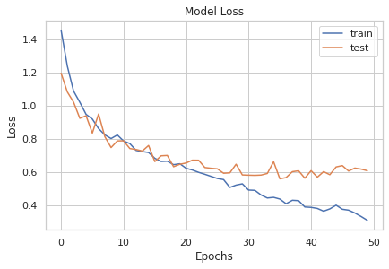
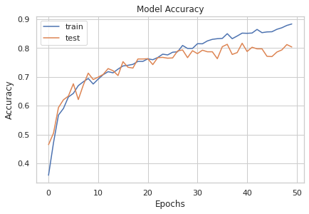
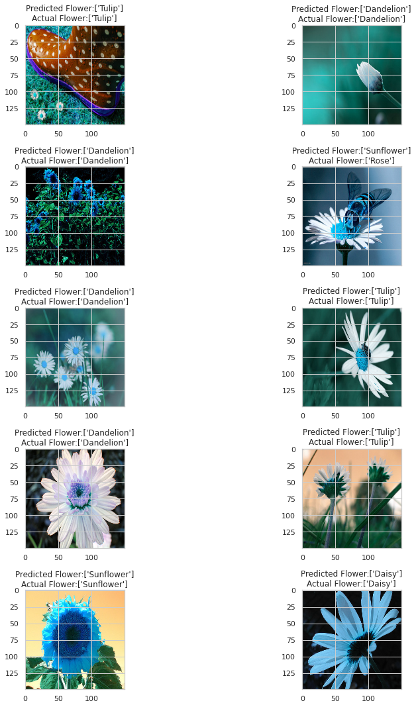

# 說明
本題使用tensorflow keras 訓練CNN模型對花的圖片做分類

# 環境
google colaboratory

# 步驟
1. 下載[kaggle](https://www.kaggle.com/alxmamaev/flowers-recognition)資料，並將資料上傳至google drive，並取得連結
2. import所需modules
3. 載入資料，並對標籤做label encoding與one hot encoding，將圖片常態化，切割training set與validation set。
4. 建立CNN模型並訓練，顯示出模型訓練時accuracy與loss分數
5. 顯示隨機10筆預測後的結果與正解

# 分析
## model loss

評語:在epoch為20後test分數並沒有太大變化，train分數還在不斷下降
## model accuracy

評語:在epoch為20後test分數並沒有太大變化，train分數還在不斷上升
## 隨機10筆預測後的結果與正解做比較

# 結論
模型在訓練時，雖然訓練集的accuracy不斷上升且loss不斷下降，但是測試集的accuracy與loss在第20次訓練後並沒有太大的變化。模型大約訓練20次就足夠了。