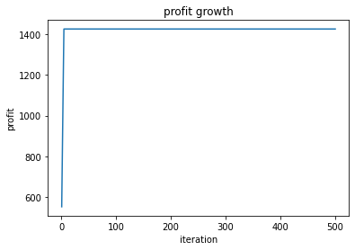
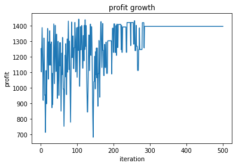

# 說明
在0/1背包問題，背包最多可以承受C的重量，並給予n個物品，每個物品有相應的重量與價值。在物品重量不超過C的情況下求出最大物品價值。

# 環境
google colaboratory

# 步驟
## dynamic programming
1. 建立表格K，有n+1行、C+1列
2. 用dynamic programming方法計算表格內的值:
##
    1.當i=0或c=0時，K[i][c]=0
    2.當第i個物品拿得起來的時候，計算拿或不拿第i個物品可以得到最佳解
    3.當第i個物品拿不動時，K[i][c]=K[i-1][c]

## hill climbing
狀態使用0與1組成的字串來表示，0表示不拿，1表示拿。

狀態profits的計算方式:把所有狀態中元素值為1的重量與價值加總起來。如果超重回傳-1，否則回傳總價值。

找鄰近狀態的方法:將當前狀態值的每個元素分別置換，1換0，0換1，若無超重則為鄰近狀態。

初始狀態的生成使用隨機生成，如果產生出的結果超重則重新生成。

本題使用steepest-ascent hill climbing，每次都檢查所有鄰近狀態，最高價值的鄰近狀態為新的next_state。

### 步驟:
1. 產生出一個initial_state，並將值給current_state。
2. 重複迭代500次

    a.尋找所有neighbor_state，找出profits最高的state為next_state，最高的profits為next_profits。
    b.如果next_profits高於current_state的profits，則將next_state指派為新的current_state。
3. 印出迭代圖

## simulated annealing
狀態使用0與1組成的字串來表示，0表示不拿，1表示拿。

狀態profits的計算方式:把所有狀態中元素值為1的重量與價值加總起來。如果超重回傳-1，否則回傳總價值。

找鄰近狀態的方法:將當前狀態值隨機挑一個元素，1換0，0換1，若無超重則為鄰近狀態，然後回傳。

初始狀態的生成使用隨機生成，如果產生出的結果超重則重新生成。

退火值為e的(新的profit與目前的profit差值再除T)次方

### 步驟:
1. 設定迭代次數、初始溫度(T)、退火係數。產生一個隨機初始狀態及初始狀態的profit。
2. 找到一個鄰近狀態，並產生一個介於0~1之間的值與退火值比較，若小於等於退火值則可以更新目前的狀態，然後將T乘一個小於1的數。重複500次。
3. 印出迭代圖

# 分析
## hill climbing
以下是使用hill climbing來找尋最大profit的迭代圖

在前幾次就找到local_maximum，但是鄰近的狀態的profit都較低，所以只能維持在一樣的profit直到結束。
## simulated annealing
以下是使用simulated annealing來找尋最大profit的迭代圖

profit值一開始會變動幅度比較大，然後隨著T值變小逐漸收斂至一定值
# 結論
本題資料集並不大，使用dynamic programming也可以快速找到最佳解，使用hill climbing也可以在前幾次迭代就找到近似解，而simulated annealing則要做幾百次迭代才會收斂至近似解。